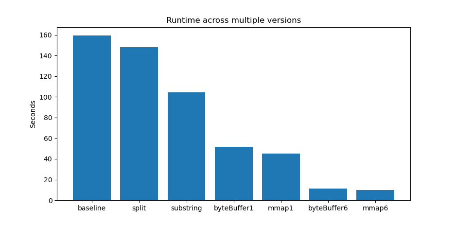

# Challenge

The *[1 Billion row challenge](https://github.com/gunnarmorling/1brc)* consists of parsing a large csv file as fast as possible on a single host, in **Java**.

Each line in the file contains a city name where a weather station is located, associated with a temperature measurement.

```
Tokyo;35.6897
Delhi;28.6100
Mexico City;19.4333
Tokyo;12.3456
```

The parser needs to aggregate temperatures by cities, calculating the respective *min*, *average* and *max* metrics for each city.

For example the output for above input file is

```
{
    Delhi=28.6/28.6/28.6,
    Mexico City=19.4/19.4/19.4,
    Tokyo=12.3/24.0/35.7
}
```

### Results

The code for the solutions is available in Github repo:

> [https://github.com/alexis779/1BillionRowChallenge](https://github.com/alexis779/1BillionRowChallenge)

See below the runtime comparison of the versions implemented in the project.




| Version | Description |
| - | - |
| baseline| The solution proposed by the organizer|
|split| `String.split` |
|substring| `String.indexOf`, `String.substring` |
|mmap1| MMap with 1 thread|
|mmap6| MMap with 6 threads|


## Multi-Threading

Multi-Threading gain was measured over a range of 1 to 12 threads, the max being the total number of *virtual* cores, on an SMT (*Simultaneous Multi-Threading*) processor, `AMD Ryzen™ 5 7530U with Radeon™ Graphics × 12`, but with 6 actual *physical cores*.

A concurrency of `6` yields a throughput multiplication factor of `5`, which is great parallelization. However, increasing it further had diminishing returns.


A lack of parallelization gain beyond a concurrency `6` would indicate a limitation of the SMT architecture for IO-bound application ?


## Best practices

### Methodology

Focusing on the right problem to solve is key to make progress in the optimization effort.

CPU profiling report analysis should drive the next iteration. The highest priority falls on the highest contributor in CPU utilization. Getting to the next level may require a small refactoring or a significant re-design.

### Avoid String parsing

Encoding the raw byte stream into UTF-8 characters is not required for aggregation purpose. The final step reporting the results can perform the String encoding, only once per city name. But the line or the city name does not need to be parsed as a String for each row.

### Add parallelization

Multi-threading leverages multi-core processor, effectively dividing the load across worker threads.

### Scan the stream once

Iterating through byte array is an expensive operation. To avoid re-scanning parts of the sequence, the parser should precompute all the necesary values in the first pass. The city name needs the byte array, length and hash key. The temperature needs the sign, the integer part and the fractional part of the floating number. For example when scanning the digits that make up the integer part, the parser needs to traverse them in reverse order. It can then reduce the sequence of digits in base 10 into a sum.

### Reuse objects

Creating a new Object for each row over a 1B dataset causes high memory pressure. It kicks off Garbage Collection thread to reclaim memory, wasting CPU cycles. This also causes a high variability in latency when repeating the run on the same payload, providing unpredicable results.

### Use MMap

Large portions of the file (up to 2 GB) can be memory-mapped. This OS feature provides a convenient abstraction for the parser. It can then read the stream sequentially, as if it was accessing a single buffer like an array in memory. The OS takes care of buffering. It saves the application from reading bytes by batch of fixed size, having to figure out the start offset of the first full line, the end offset of the last full line and stitch together the lines overlapping with the previous or the next batch.

### To be continued


## CPU profile

Looking at the flame graph, CPU time breaks down into the main operations

| Step | Operation | method |
| --- | --- | --- |
1 | parsing the city name | `parseStationName`
2 | parsing the temperature value | `parseDouble`
3 | looking up the city name in the hash map | `HashMap.get`

